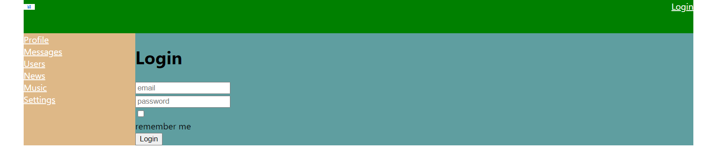
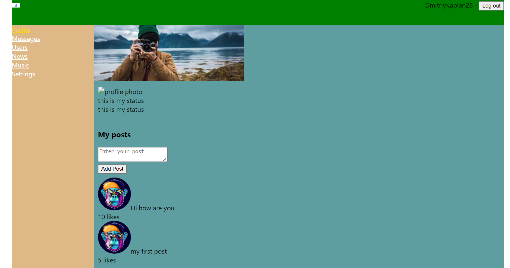
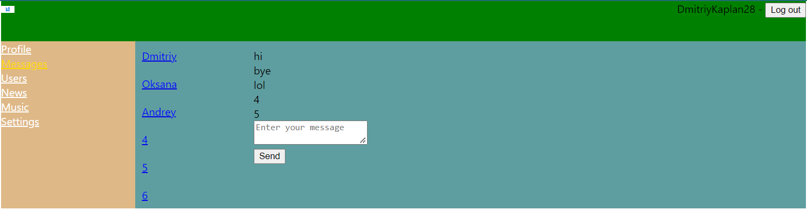
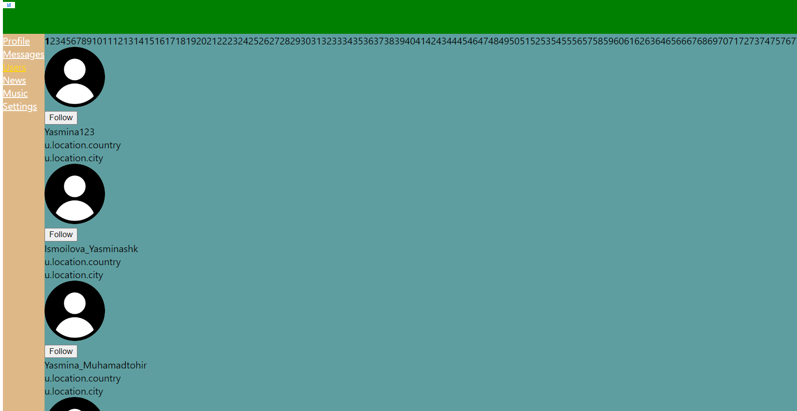

Hello, friends!
This project is social network. The following libraries were installed and used in this project:

- **axios** 
- **classnames**
- **formik**
- **gh-pages**
- **jest**
- **react** and **@types/react**
- **react-dom** and **@types/react-dom**
- **react-redux** and **@types/react-redux**edux
- **react-router-dom** and **@types/react-router-dom**act-router-dom
- **react-scripts** 
- **react-test-renderer** and **@types/react-test-renderer**/react-test-renderer
- **redux**
- **redux-form** and **@types/redux-form**rm
- **redux-thunk**
- **reselect**
- **typescript** 
- **uuid** and **@types/uuid**

